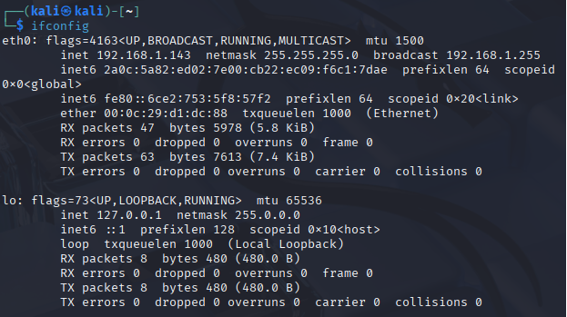
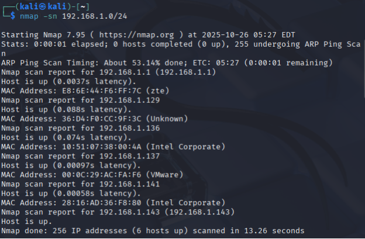
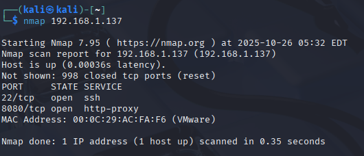
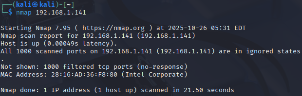
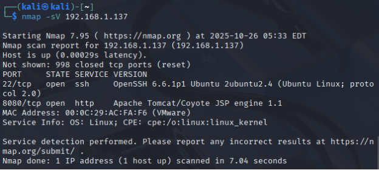
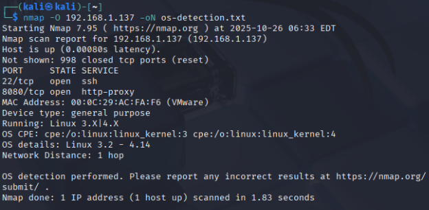
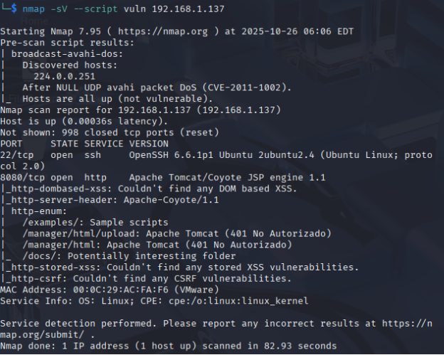

**1. INTRODUCCIÓN A NMAP**

Nmap (Network Mapper) es la herramienta de código abierto más utilizada para exploración de redes y análisis de seguridad. Es fundamental en el arsenal de cualquier analista de vulnerabilidades, pentester y profesional de ciberseguridad.

Características principales:

- Descubrimiento de hosts activos en redes
- Escaneo de puertos TCP/UDP (1-65535)
- Detección de servicios y versiones exactas
- Identificación de sistemas operativos (OS fingerprinting)
- Más de 600 scripts NSE para detección de vulnerabilidades
- Exportación en múltiples formatos (XML, JSON, texto)

Casos de uso:

- Pentesting y Red Team operations
- Auditorías de seguridad técnicas
- Bug bounty hunting
- Análisis de superficie de ataque
- Validación de configuraciones de seguridad
- Identificación de servicios obsoletos y vulnerables

**2. INSTALACIÓN**

En Kali Linux (preinstalado):

- Comando: nmap --version

En Windows:

- Descarga desde [**https://nmap.org/download.html**](https://nmap.org/download.html "https://nmap.org/download.html") e instala el ejecutable.

**3. RECONOCIMIENTO DE RED**

**3.1. Identificar tu Red Local**

Comando previo en Linux/macOS: ifconfig

Resultado obtenido en prueba práctica:

**Análisis**: Máquina escaneadora con IP 192.168.1.143 y máscara /24 = rango completo 192.168.1.0-255 (256 direcciones).

**3.2. Descubrimiento de Hosts (Ping Scan)**

Comando ejecutado: nmap -sn 192.168.1.0/24

Descripción: Ping scan sin escaneo de puertos. Identifica dispositivos activos rápidamente usando ARP requests en redes locales.

Flags utilizadas:

-sn: Ping Scan (no port scan)

/24

Resultados obtenidos:

Análisis del resultado:

Total hosts activos: 6 de 256 escaneados

- Tiempo: 13.26 segundos (rápido en red local)
- Gateway: 192.168.1.1 (Router ZTE)
- VM objetivo: 192.168.1.137 (VMware)
- Latencias: Milisegundos (red local)

**4. ESCANEO DE PUERTOS**

**4.1. Escaneo Básico**

Comando: nmap 192.168.1.137

Qué hace: Escanea los 1000 puertos TCP más comunes (lista predefinida en Nmap).

Resultados obtenidos:

Análisis de superficie de ataque:

- 2 puertos expuestos = 2 vectores potenciales de ataque
- Puerto 22 (SSH): Acceso administrativo remoto
- Puerto 8080 (HTTP): Servidor web/aplicación
- 998 puertos cerrados: Respondiendo con TCP RST

**4.2. Estados de Puertos en Nmap**

|**Estado**|**Significado**|**Respuesta TCP**|
| :- | :- | :- |
|open|Servicio activo escuchando|SYN/ACK|
|closed|Puerto sin servicio, pero alcanzable|RST|
|filtered|Bloqueado por firewall|Sin respuesta / ICMP unreachable|
|open|filtered|Nmap no puede determinar|Sin respuesta definitiva|
|closed|filtered|Nmap no puede determinar|Respuesta ambigua|

**4.3. Comparación con Host Protegido**

Comando:

nmap 192.168.1.141

Resultado:

Conclusión: Todos los puertos filtrados (firewall activo) vs. VM con puertos abiertos = superficie de ataque mayor en la VM.

**5. DETECCIÓN DE SERVICIOS Y VERSIONES**

**5.1. Comando de Detección (-sV)**

Comando ejecutado:

nmap -sV 192.168.1.137

Descripción: La bandera -sV activa probing avanzado para identificar versiones exactas de servicios. Esencial para análisis de vulnerabilidades.

Resultado: 

Información obtenida:

|**Puerto**|**Servicio**|**Versión Completa**|**SO**|
| :- | :- | :- | :- |
|22|SSH|OpenSSH 6.6.1p1 Ubuntu 2ubuntu2.4|Ubuntu Linux|
|8080|HTTP|Apache Tomcat/Coyote JSP engine 1.1|Linux|

**5.2. Detección de Sistema Operativo (OS Fingerprinting)**

Comando ejecutado:

nmap -O 192.168.1.137 -oN os-detection.txt

Descripción: La bandera -O activa la detección de sistema operativo mediante análisis de la pila TCP/IP. Nmap envía una serie de paquetes TCP y UDP al host objetivo y examina las respuestas, comparándolas con una base de datos de más de 2,600 fingerprints de sistemas operativos conocidos.

**Análisis del resultado:**

Tipo de dispositivo: General purpose (dispositivo de propósito general, no es router, switch o dispositivo especializado)

Sistema operativo detectado: Linux kernel versiones 3.X o 4.X

Rango específico identificado: Linux 3.2 - 4.14

CPE (Common Platform Enumeration):

- cpe:/o:linux:linux\_kernel:3
- cpe:/o:linux:linux\_kernel:4

Distancia de red: 1 salto (confirma que está en la misma red local)

Utilidad de esta información:

Conocer el kernel exacto es muy útil para:

- Búsqueda de exploits específicos del kernel (privilege escalation)
- Identificar vulnerabilidades conocidas de versiones antiguas de Linux
- Determinar parches de seguridad aplicables
- Planificar estrategias de post-explotación

**6. ANÁLISIS DE VULNERABILIDADES CON NSE**

Categorías principales:

- vuln: Detección de vulnerabilidades conocidas
- exploit: Explotación activa de vulnerabilidades
- auth: Ataques de fuerza bruta y credenciales débiles
- discovery: Enumeración de información
- safe: Scripts no intrusivos
- default: Scripts estándar ejecutados con -sC

**7. RESULTADOS DEL ESCANEO CON SCRIPTS NSE DE VULNERABILIDADES**

**7.1. Comando Ejecutado y Contexto**

Comando utilizado: nmap -sV --script vuln 192.168.1.137

Descripción: Este comando ejecuta la categoría completa de scripts NSE de vulnerabilidades, realizando pruebas activas de seguridad sobre los servicios detectados. Los scripts vuln incluyen más de 100 pruebas automatizadas que buscan vulnerabilidades conocidas en servicios web, SSH, SMB, SSL/TLS y otros protocolos comunes.

**Resultado**

**Análisis hallazgos**

**Script: http-enum (HALLAZGOS CRÍTICOS)**

Propósito: Enumerar directorios, archivos y recursos interesantes en servidores web

Este script produjo los hallazgos más significativos del análisis:

**HALLAZGO: Ruta /manager/html/upload**

Descripción: Apache Tomcat Manager - Upload functionality

Estado HTTP: 401 No Autorizado (requiere autenticación)

Tipo de recurso: Interfaz de carga de aplicaciones WAR

Nivel de riesgo: CRÍTICO

Explicación detallada: Esta es la ruta más peligrosa identificada en el análisis. El panel /manager/html/upload permite subir archivos WAR (Web Application Archive) al servidor Tomcat. Si un atacante obtiene acceso autenticado a esta funcionalidad, puede:

1. Desplegar aplicaciones web maliciosas completas
1. Obtener ejecución de código arbitrario en el contexto del servidor
1. Instalar web shells persistentes
1. Comprometer completamente el servidor

**HALLAZGO 2: Ruta /manager/html**

Descripción: Apache Tomcat Manager - Main interface

Estado HTTP: 401 No Autorizado (requiere autenticación)

Tipo de recurso: Panel de administración completo de Tomcat

Nivel de riesgo: CRÍTICO

Explicación detallada: Esta es la interfaz principal del Tomcat Manager que permite gestión completa del servidor:

Funcionalidades disponibles tras autenticación:

- Desplegar y eliminar aplicaciones WAR
- Iniciar, detener y recargar aplicaciones
- Ver sesiones activas de usuarios
- Gestionar recursos del servidor
- Acceder a información del sistema operativo
- Modificar configuraciones en tiempo real

Relación con /manager/html/upload: Ambas rutas son parte del mismo componente de administración, siendo /manager/html la interfaz principal y /upload la funcionalidad específica de carga.

Riesgo adicional: La interfaz completa proporciona más información al atacante:

- Versión exacta de Tomcat (útil para búsqueda de exploits específicos)
- Aplicaciones desplegadas (superficie de ataque adicional)
- Rutas del sistema de archivos
- Configuración JVM y recursos disponibles

Vector de ataque: Idéntico a /manager/html/upload. Si se compromete, permite:

1. Acceso a información sensible del servidor
1. Despliegue de aplicaciones maliciosas
1. Modificación de aplicaciones legítimas existentes
1. DoS mediante consumo de recursos

**8. LIMITACIONES DE NMAP Y COMPARACIÓN CON NESSUS Y METASPLOIT**

Nmap es fundamentalmente una herramienta de reconocimiento y mapeo de red, diseñada para descubrir hosts, identificar puertos abiertos y detectar servicios con sus versiones. Su fortaleza está en la velocidad  y versatilidad con más de 600 scripts NSE. Sin embargo, tiene limitaciones importantes: los scripts de vulnerabilidades (vuln) no correlacionan automáticamente versiones con bases de datos CVE completas, y requiere verificación manual posterior.

Nessus, por el contrario, es un escáner de vulnerabilidades dedicado con más de 175,000 checks de seguridad que correlaciona exhaustivamente cada versión de software con CVEs, proporciona CVSS scores, recomendaciones de remediación detalladas y genera informes ejecutivos en PDF. El tiempo de análisis es significativamente mayor, pero la cobertura es completa y la tasa de falsos positivos es menor. 

Metasploit tiene un propósito completamente diferente: es un framework de explotación, no de reconocimiento. Mientras Nmap identifica que el puerto 8080 tiene Tomcat Manager expuesto, Metasploit puede usar módulos  para intentar credenciales por defecto y, si tiene éxito, emplear exploits para desplegar una web shell y obtener control total del servidor. Metasploit convierte la información que Nmap proporciona en acciones de explotación reales.

**8.1. Flujo de Trabajo Recomendado**

El enfoque profesional combina las tres herramientas en secuencia: usar Nmap para reconocimiento inicial rápido identificando hosts y servicios, seguido de Nessus o OpenVAS para análisis exhaustivo de CVEs en hosts críticos, y finalmente Metasploit para validar la explotabilidad real de vulnerabilidades críticas encontradas. Esta metodología optimiza tiempo y recursos, usando la velocidad de Nmap para priorizar objetivos y la profundidad de Nessus para análisis detallado, reservando Metasploit solo para validación de impacto cuando se tiene autorización de explotación.

**9. METODOLOGÍA DE ANÁLISIS CON NMAP**

**FASE 1: Reconocimiento Pasivo**

- ifconfig/ipconfig → Identificar rango de red

**FASE 2: Descubrimiento de Hosts**

- nmap -sn red → Identificar hosts activos 

**FASE 3: Mapeo de Superficie**

- nmap target → Identificar puertos abiertos 

**FASE 4: Fingerprinting**

- nmap -sV target → Versiones de servicios 

**FASE 5: Análisis de Vulnerabilidades**

- nmap --script vuln target → Detección de CVEs 
- nmap --script vulners target → Correlación CVE 

**FASE 6: Documentación**

nmap -oA proyecto target → Exportar resultados

` `**(**Se adjunta diagrama de flujo)

**10. QUICK REFERENCE NMAP**

Reconocimiento:

- nmap -sn 192.168.1.0/24 → Ping scan (descubrir hosts)
- nmap -sL 192.168.1.0/24 → List scan (sin enviar paquetes)

Escaneo de Puertos:

- nmap target → Escaneo básico (1000 puertos comunes)
- nmap -p- target → Todos los puertos (1-65535)
- nmap -p 80,443,8080 target → Puertos específicos
- nmap --top-ports 100 target → Top 100 puertos más comunes
- nmap -sU -p 53,161,500 target → Escaneo UDP

Detección de Servicios:

- nmap -sV target → Detección de versiones
- nmap -A target → Escaneo agresivo (OS, versiones, scripts, traceroute)
- nmap -O target → Detección de SO

Scripts NSE:

- nmap --script vuln target → Vulnerabilidades
- nmap --script vulners target → CVEs por versión
- nmap --script auth target → Credenciales débiles
- nmap --script http-enum -p 80,8080 target → Directorios web
- nmap --script ssl-enum-ciphers -p 443 target → Cifrados SSL/TLS

Timing y Evasión:

- nmap -T4 target → Rápido (redes locales)
- nmap -T2 target → Sigiloso
- nmap -sS target → SYN scan (semi-abierto)
- nmap -f target → Fragmentar paquetes
- nmap -D RND:10 target → Decoys aleatorios

Exportación:

- nmap -oN archivo.txt target → Formato normal
- nmap -oX archivo.xml target → Formato XML
- nmap -oA proyecto target → Todos los formatos

11\. CONCLUSIONES

Este análisis práctico con Nmap ha demostrado su eficacia como herramienta de reconocimiento inicial, identificando en menos de 2 minutos una superficie de ataque significativa en la máquina virtual objetivo: OpenSSH 6.6.1p1 obsoleto con múltiples CVEs conocidos y el panel de administración Tomcat Manager expuesto sin protección adecuada.

Las principales lecciones aprendidas incluyen:

- Los scripts NSE vuln no detectan automáticamente todos los CVEs por versión, requiriendo verificación manual
- La combinación de comandos (-sV, -O, --script vuln) proporciona visión completa del objetivo
- Nmap es ideal para reconocimiento rápido, pero debe complementarse con Nessus para análisis exhaustivo y Metasploit para validación de explotabilidad

